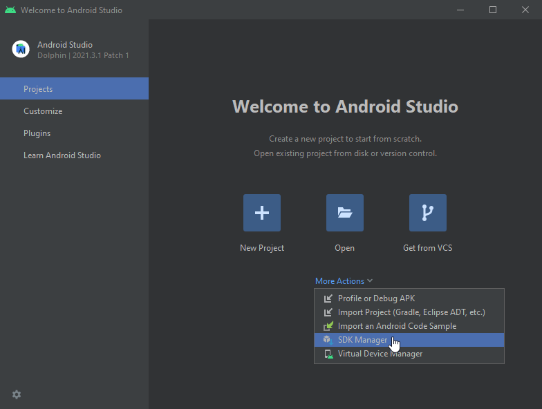
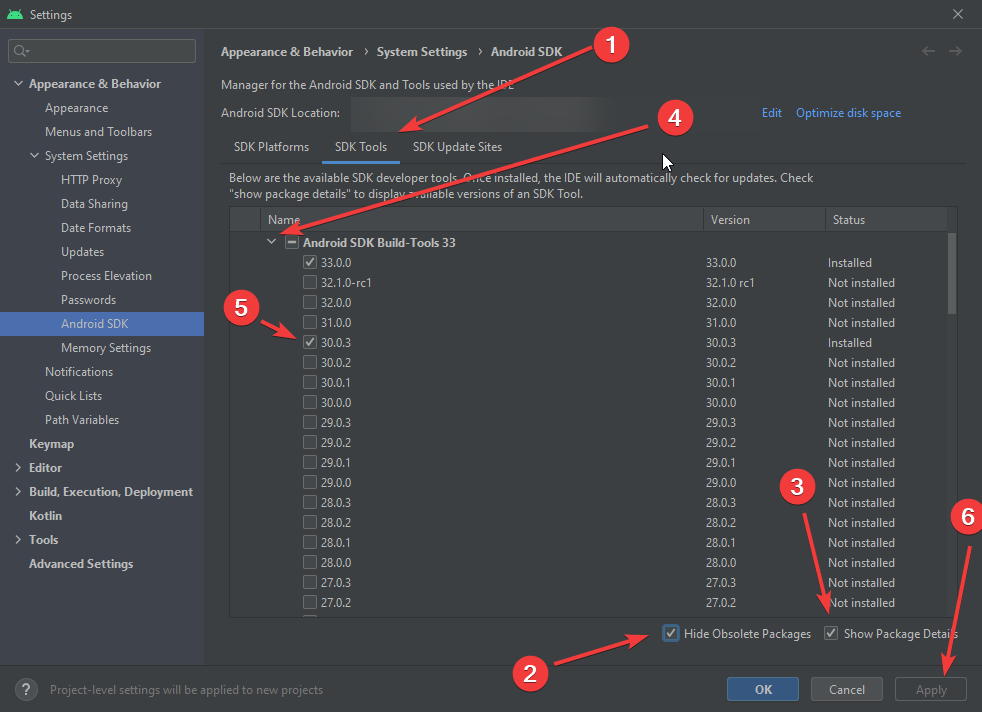
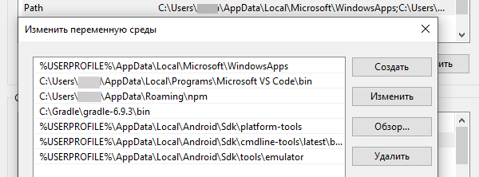
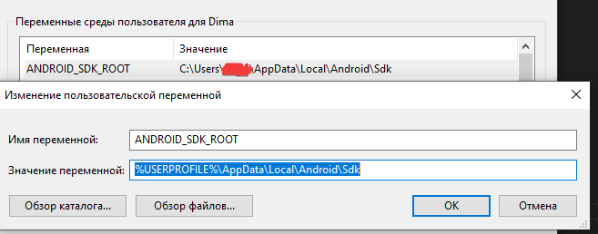

# OperPlan

Это мобильное приложение скомпилированное на **[Apache Cordova](https://cordova.apache.org/)** и **[Vue.js](https://vuejs.org/)**.

## Подготовка среды для запуска

Первое что необходимо сделать это настроить окружение, установить необходимые программы для конкретной платформы и добавить переменные среды.

### Платформа Android

[Официальная инструкция по настройке от Apache Cordova](https://cordova.apache.org/docs/en/11.x/guide/platforms/android/index.html#requirements-and-support)
[Требования к системе](https://developer.android.com/studio#Requirements)

- Установите [Node.js](https://nodejs.org/en/)
- Установите [Java Development Kit (JDK) 11](https://www.oracle.com/java/technologies/downloads/#java11) (нужна регистрация)  
  *Переменная среды `JAVA_HOME` должна быть установлена ​​в соответствии с вашим путем установки JDK при установке в среде Windows. См. раздел  **[«Настройка переменных среды»](#настройка-переменных-среды)** о том, как настроить переменные среды.*
- Установите [Gradle](https://gradle.org/install/).  
  *При установке в Windows вам необходимо добавить `PATH` к двоичному каталогу **Gradle** в переменную среды пути. См. **[«Настройка переменных среды»](#настройка-переменных-среды)**) о том, как настроить системные переменные среды.*
- Установите [Android Studio](https://developer.android.com/studio)

#### Добавление пакетов SDK

Запустите **Android Studio**. Нажмите `More Actions` -> `SDK Manager`

Установите `Android build tools version 30.0.3`. Перейдите на вкладку `SDK Tools`, установите галочки `Hide Obsolete Packages` и `Show Package Details`. Разверните детали пакета `Android SDK build-tools 33` и установите версию `30.0.3`. Нажмите кнопку `Apply` и дождитесь завершения установки.

## Настройка переменных среды

Интерфейсу командной строки Cordova требуются определенные переменные среды, чтобы он мог работать правильно. Если переменные среды отсутствуют, интерфейс командной строки попытается временно разрешить переменную. Если отсутствующие переменные не разрешаются, их необходимо установить вручную.

Должны быть установлены следующие переменные:

`JAVA_HOME` — переменная среды для расположения вашей установки JDK.
`ANDROID_SDK_ROOT` — переменная среды, указывающая место установки Android SDK.
Также рекомендуется обновить переменную среды `PATH`, включив в нее следующие каталоги.

- `cmdline-tools/latest/bin`
- `emulator`
- `platform-tools`
- `build-tools`

This is required for the apksigner and zipalign tools.

### MacОS и Linux

На Mac или Linux с помощью текстового редактора создайте или измените файл `~/.bash_profile`.

Чтобы установить переменную среды, добавьте строку, которая использует экспорт следующим образом (замените путь вашей локальной установкой):

`export ANDROID_SDK_ROOT=/Development/android-sdk/`

Чтобы обновить `PATH`, добавьте строку, подобную следующей (замените пути на местоположение вашей локальной установки Android SDK):

`export PATH=$PATH:$ANDROID_SDK_ROOT/platform-tools/`  
`export PATH=$PATH:$ANDROID_SDK_ROOT/cmdline-tools/latest/bin/`  
`export PATH=$PATH:$ANDROID_SDK_ROOT/emulator/`

Перезагрузите терминал, чтобы увидеть это изменение, или выполните следующую команду:

`source ~/.bash_profile`

### Windows

Эти шаги могут различаться в зависимости от установленной версии Windows. Закройте и снова откройте все окна командной строки после внесения изменений.

1. Введите в строке поиска **«Изменение системных переменных среды»**
2. Выберите **«Изменение системных переменных среды»**.
3. Нажмите на кнопку `Переменные среды...` в появившемся окне.

Чтобы создать новую переменную среды

1. Нажмите кнопку `Создать…`
2. Введите `Имя переменной`
3. Введите `Значение переменной`
4. Нажмите кнопку `ОК`

Чтобы добавить переменную в `PATH`

1. Выберите `PATH` из списка уже определенных переменных
2. Нажмите на кнопку `Изменить…`
3. Нажмите кнопку `«Создать»`.
4. Введите соответствующее местоположение.

Добавить эти пути в переменную `PATH`:

`%USERPROFILE%\AppData\Local\Android\Sdk\platform-tools`
`%USERPROFILE%\AppData\Local\Android\Sdk\cmdline-tools\latest\bin`
`%USERPROFILE%\AppData\Local\Android\Sdk\tools\emulator`

Создайте следующее значение в переменную `ANDROID_SDK_ROOT`:

`%USERPROFILE%\AppData\Local\Android\Sdk`

После того, как все пути будут добавлены, нажимайте кнопку OK, пока все открытые окна для установки и редактирования переменных среды не будут закрыты.
